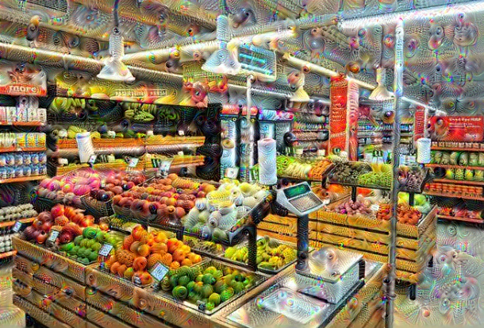

# DeepDream Generation

This README provides an in-depth explanation of the DeepDream algorithm, how it works, and how to use the DeepDream feature in our Streamlit app. The DeepDream feature allows users to transform their images into surreal, dream-like visuals by leveraging the power of deep neural networks.

## Overview of DeepDream

DeepDream is an algorithm developed by Google to create images that amplify patterns detected by a neural network, producing a hallucinogenic, dream-like effect. It was originally designed to help visualize the patterns learned by a neural network during training, but it quickly became popular for its ability to create unique, artistic visuals.

## Detailed Explanation of How DeepDream Works

### 1. **Understanding Convolutional Neural Networks (CNNs):**
   - At the heart of DeepDream is a Convolutional Neural Network (CNN), typically a pre-trained model like InceptionV3.
   - CNNs are composed of multiple layers, each designed to detect specific features in an image, such as edges, textures, or even complex patterns like faces or objects.
   - The early layers in a CNN detect simple features like edges and corners, while deeper layers detect more complex features and objects.

### 2. **Activation Maximization:**
   - The core idea behind DeepDream is to modify an input image in such a way that the activations of specific neurons (or filters) in the network are maximized.
   - Normally, an image is passed through the network to classify or analyze it. In DeepDream, we reverse this process by asking the network to modify the image itself to make certain features more prominent.
   - This process is done by computing the gradient of the neuron activations with respect to the input image and then adjusting the image to increase those activations. This is similar to how backpropagation works in training, but here we are optimizing the image instead of the model weights.

### 3. **Gradient Ascent on Input Image:**
   - The image is passed through the CNN, and the activations of certain layers are calculated.
   - The gradients of these activations with respect to the input image are then computed. These gradients tell us how to change the image to increase the activations.
   - The image is slightly adjusted in the direction of the gradient (this process is known as gradient ascent).
   - This step is repeated over multiple iterations, gradually exaggerating the features detected by the network.

### 4. **Layer Selection:**
   - The choice of layer(s) in the network is crucial to the final output. Different layers capture different levels of abstraction:
     - **Shallow layers** capture simple features like edges or textures, leading to subtle changes in the image.
     - **Deeper layers** capture complex structures like objects or faces, resulting in more dramatic and abstract transformations.
   - By experimenting with different layers, you can control the type of patterns that emerge in the DeepDream image.

### 5. **Octave Scaling:**
   - To add more detail and structure to the DeepDream images, the process is often repeated at multiple scales (octaves).
   - The image is gradually zoomed in (scaled up), and DeepDream is applied at each scale. This helps reinforce the patterns across different levels of detail, making the final image more intricate and surreal.

### 6. **Final Output:**
   - The result of applying DeepDream is an image that looks like it’s filled with strange, repeating patterns. Objects in the image might appear to morph into bizarre, dream-like forms, with a strong emphasis on certain textures and colors.
   - The final image is a combination of the original content, as interpreted and enhanced by the CNN, resulting in a highly stylized, psychedelic version of the original.

## Example Images

Here are some examples of input images and their corresponding DeepDream results:

| Original Image | DeepDream Image |
|----------------|-----------------|
|  |  |

## Key Components

- **Model:** We use a pre-trained InceptionV3 model for the DeepDream algorithm. This model is known for its ability to detect complex patterns and objects.
- **Layers:** We can choose which layers of the model to use for the DeepDream process, allowing us to control the complexity and type of patterns that emerge.
- **Octaves:** By processing the image at multiple scales (octaves), we enhance the intricate details of the dream-like patterns.

## How to Use the Feature in the App

1. **Upload Image:**
   - Start the app and navigate to the DeepDream feature.
   - Upload an image by clicking the upload button and selecting an image file from your device.

2. **Run DeepDream:**
   - Once the image is uploaded, click on the "Generate DeepDream Image" button.
   - The app will apply the DeepDream algorithm and display the transformed image.

3. **View and Save Results:**
   - The original and DeepDream images will be displayed side by side.
   - You can download the DeepDream image by right-clicking on it and selecting "Save As."

## Additional Information

- **Customization:** In future versions, we plan to allow users to adjust parameters such as the layer selection and the number of iterations to customize the DeepDream effect.
