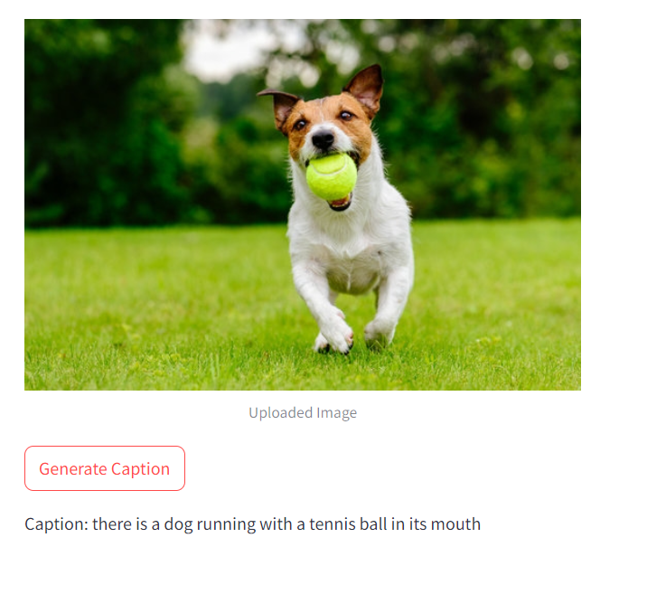

# Image Captioning

This README provides an in-depth explanation of the image captioning algorithm, how it works, and how to use the Image Captioning feature in our Streamlit app. The Image Captioning feature allows users to upload an image and generate a descriptive caption using a pre-trained model via the Hugging Face API.

## Overview of Image Captioning

Image captioning is the task of generating a textual description for an image. It combines techniques from computer vision and natural language processing (NLP) to interpret the visual content of an image and express it in a coherent sentence.

## Detailed Explanation of How Image Captioning Works

### 1. **Understanding the Image Captioning Process:**
   - The image captioning model typically consists of two main components:
     - **Encoder (Vision Model):** A convolutional neural network (CNN) is used to extract visual features from the image. These features capture the important aspects of the image, such as objects, actions, and scenes.
     - **Decoder (Language Model):** A recurrent neural network (RNN), often implemented as an LSTM or GRU, is used to generate a caption based on the visual features extracted by the encoder.

### 2. **Encoder:**
   - The encoder is usually a pre-trained CNN like ResNet, VGG, or Inception, which has been trained on large image datasets like ImageNet.
   - The image is passed through the CNN, and the output is a set of feature maps that represent different aspects of the image.
   - These feature maps are then flattened and transformed into a feature vector that serves as the input to the decoder.

### 3. **Attention Mechanism (Optional):**
   - Some image captioning models include an attention mechanism that allows the decoder to focus on different parts of the image when generating each word in the caption.
   - The attention mechanism dynamically weights the importance of different regions of the image, helping the model generate more accurate and contextually relevant captions.

### 4. **Decoder:**
   - The decoder is a language model, typically an LSTM or GRU, that generates the caption word by word.
   - At each time step, the decoder predicts the next word in the caption based on the current state, the previously generated words, and the visual features from the encoder.
   - The process continues until the model generates an end-of-sequence token, indicating the caption is complete.

### 5. **Training the Model:**
   - Image captioning models are typically trained on datasets like MSCOCO, which consist of images paired with multiple captions.
   - During training, the model learns to minimize the difference between the predicted captions and the ground truth captions using a loss function like cross-entropy loss.
   - The model is optimized using gradient descent, adjusting the weights of both the encoder and decoder to improve caption accuracy.

### 6. **Hugging Face API:**
   - In our app, we use a pre-trained image captioning model available via the Hugging Face API. This allows us to leverage state-of-the-art models without needing to train them from scratch.
   - The Hugging Face API provides a convenient interface to generate captions by sending the image to the model and receiving the generated caption as output.

### 7. **Final Output:**
   - The final output is a caption that describes the content of the image in a coherent and natural way. The caption typically includes information about the objects present, their actions, and the overall scene.

## Example Images

Here are some examples of input images and their corresponding generated captions:

| Image             | Generated Caption            |
|-------------------|------------------------------|
|  | "A dog is running through a grassy field." |

## Key Components

- **Encoder:** A pre-trained CNN (e.g., ResNet, VGG) is used to extract visual features from the input image.
- **Decoder:** An LSTM or GRU model generates the caption based on the visual features provided by the encoder.
- **Attention Mechanism:** (Optional) Enhances the captioning process by focusing on different parts of the image during caption generation.
- **Hugging Face API:** Utilizes a pre-trained image captioning model for generating captions without the need for local model training.

## How to Use the Feature in the App

1. **Upload Image:**
   - Start the app and navigate to the Image Captioning feature.
   - Upload an image by clicking the upload button and selecting an image file from your device.

2. **Generate Caption:**
   - Once the image is uploaded, click on the "Generate Caption" button.
   - The app will send the image to the Hugging Face API, which will generate a descriptive caption.

3. **View and Save Results:**
   - The original image and the generated caption will be displayed.
   - You can copy the generated caption to your clipboard or save it for later use.

## Additional Information

- **Customization:** In future versions, we plan to allow users to choose different pre-trained models and adjust the caption generation parameters to suit their needs.
