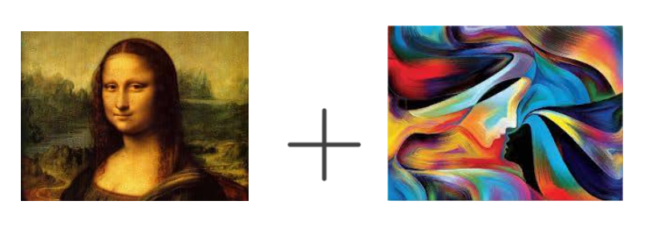
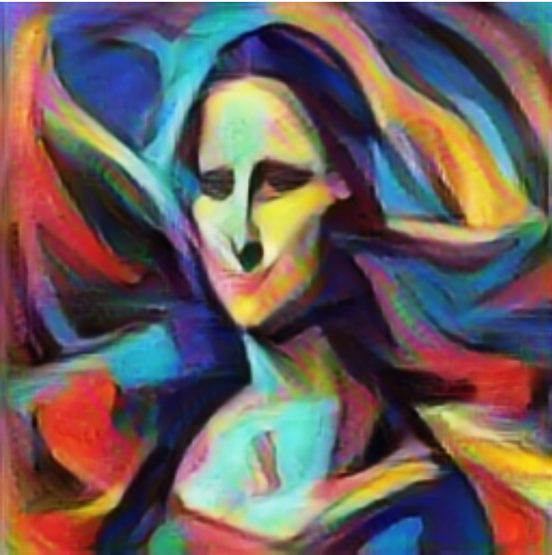

# Style Transfer

This README provides an in-depth explanation of the neural style transfer algorithm, how it works, and how to use the Style Transfer feature in our Streamlit app. The Style Transfer feature allows users to combine the content of one image with the style of another, creating unique and artistic visuals.

## Overview of Neural Style Transfer

Neural Style Transfer is an algorithm that applies the artistic style of one image to the content of another. It uses a convolutional neural network (CNN) to separate and recombine the content and style of images, allowing for the creation of new images that maintain the content of the original while adopting the artistic style of another.

## Detailed Explanation of How Style Transfer Works

### 1. **Understanding Content and Style Representations:**
   - **Content:** The content of an image refers to the actual objects, shapes, and structures present in it. For example, in an image of a dog, the dog itself is the content.
   - **Style:** The style refers to the visual appearance of an image, including colors, textures, brush strokes, and patterns. For instance, Van Gogh’s "Starry Night" has a distinct style characterized by swirling patterns and vivid colors.

### 2. **Pre-trained Convolutional Neural Network (CNN):**
   - Neural Style Transfer typically uses a pre-trained CNN, such as VGG19, which has been trained on a large dataset like ImageNet.
   - The network is used to extract feature representations of the content and style images. These features are found at different layers of the network.

### 3. **Feature Extraction:**
   - **Content Representation:** To capture the content of an image, we extract the feature map from one of the deeper layers of the network. These deeper layers contain detailed information about the structure and objects in the image.
   - **Style Representation:** The style of an image is captured by computing the Gram matrix of the feature maps from multiple layers of the network. The Gram matrix captures the correlations between different features, which represent the textures and patterns in the image.

### 4. **Loss Functions:**
   - **Content Loss:** This loss measures the difference between the content representation of the generated image and the content image. It ensures that the generated image maintains the original content.
   - **Style Loss:** This loss measures the difference between the style representation of the generated image and the style image. It ensures that the generated image adopts the artistic style of the style image.
   - **Total Variation Loss (Optional):** This loss is sometimes added to encourage spatial smoothness in the generated image, reducing noise and making the result more visually appealing.

### 5. **Optimization Process:**
   - **Initialization:** The generated image is initialized, often as a copy of the content image or a random noise image.
   - **Gradient Descent:** The algorithm minimizes the combined loss (content loss + style loss) using gradient descent. During this process, the pixels of the generated image are iteratively adjusted to reduce the loss.
   - **Result:** The result is an image that maintains the content of the original while adopting the artistic style of the style image.

### 6. **Final Output:**
   - The final image is a blend of the content and style images, where the objects and structures of the content image are preserved, but the appearance has been transformed to match the style of the style image.

## Example Images

Here are some examples of input images (content and style) and their corresponding stylized results:

| Content Image  Style Image | Stylized Image |
|----------------------------|----------------|
|  |  |

## Key Components

- **Model:** We use a pre-trained VGG19 model for feature extraction in the Style Transfer algorithm.
- **Loss Functions:** Content loss, style loss, and optionally total variation loss are combined to guide the optimization process.
- **Optimization:** The image is iteratively adjusted using gradient descent to minimize the loss and produce the final stylized image.

## How to Use the Feature in the App

1. **Upload Images:**
   - Start the app and navigate to the Style Transfer feature.
   - Upload a content image and a style image by clicking the respective upload buttons and selecting image files from your device.

2. **Run Style Transfer:**
   - Once both images are uploaded, click on the "Generate Stylized Image" button.
   - The app will apply the neural style transfer algorithm and display the stylized result.

3. **View and Save Results:**
   - The original content, style, and stylized images will be displayed.
   - You can download the stylized image by right-clicking on it and selecting "Save As."

## Additional Information

- **Customization:** In future versions, we plan to allow users to adjust parameters such as the weights of the content and style losses and the number of optimization iterations to fine-tune the stylization effect.
